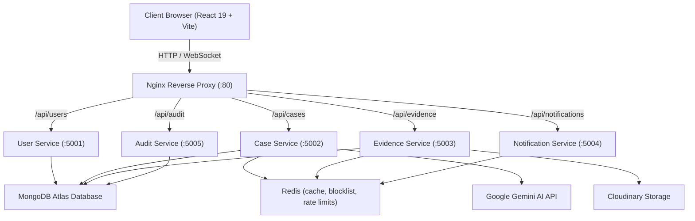

# 🛡️ Secure Digital Evidence Management System (SDEMS)

[](https://github.com/vamshiG24/secure-digital-evidence)
[](https://github.com/vamshiG24/secure-digital-evidence)
[](https://github.com/vamshiG24/secure-digital-evidence)
[](https://github.com/vamshiG24/secure-digital-evidence)

An enterprise-grade, cybersecurity-focused digital evidence management and forensic intelligence platform engineered for law enforcement, digital forensics units (DFIR), and investigative teams.

---

## 🌟 Key Features

### 1. 🔐 Cryptographic Chain of Custody & Security
* **Automated SHA-256 Checksums**: Every uploaded piece of evidence is hashed client/server side on arrival to detect tampering or bit-rot.
* **Private Evidence Storage**: Files are stored as *authenticated* Cloudinary assets. Storage URLs are never returned to clients; every read goes through the API (`/download`, `/preview`) using short-lived signed URLs and an access check on the parent case.
* **Hash-Linked Chain of Custody**: Every custody block's hash covers its index, previous hash, action, custodian, notes, timestamp **and the file's SHA-256**. Verification recomputes every block, so editing any field in the database is detected, not just a broken link.
* **Two-Factor Authentication (2FA)**: Mandatory email-based OTP verification powered by Nodemailer SMTP before granting privileged session access.
* **Role-Based Access Control (RBAC)**: **Admin** (full control, user management, audit logs), **Investigator** (own/assigned cases, upload & custody transfer), **Analyst** (read-only across all cases, integrity audits). Investigators cannot open cases they are not part of, even by ID. New registrations always start as Investigator.
* **Immutable Audit Trail**: Every case access, evidence view, hash check, and dossier export is permanently logged with IP address and client User-Agent.

### 2. 🤖 Multimodal AI Forensics & RAG Intelligence
* **Evidence Q&A (Gemini)**: Text is extracted from evidence (PDF/text; images are passed to Gemini Vision), chunked, ranked by TF-cosine similarity, and the top chunks are sent to `gemini-2.5-flash` with citations. Extracted text is cached in Redis per file hash.
* **Forensic Inspector**: Regex IOC extraction (IPs, emails, hashes, CVEs, wallets, URLs, phones) plus a structured JSON analysis from Gemini.
* **Prompt-injection hardened**: Evidence content is wrapped in `<evidence>` delimiters and the model is instructed to treat it strictly as data.
* **Court Dossier & Case Report**: The dossier verifies every custody ledger at generation time and states the result; the AI report only makes claims the ledger check supports.
* Every AI feature degrades gracefully without `GEMINI_API_KEY`.

### 3. ⚡ Scalable Microservices & DevOps Architecture
* **Containerized Deployment**: Preconfigured multi-container stack orchestrated via `docker-compose.yml`.
* **Nginx Reverse Proxy**: Single ingress point routing traffic seamlessly between the frontend and discrete backend microservices.
* **Redis**: Caching for case/evidence lists, JWT blocklist on logout, rate-limit counters and RAG text cache. Falls back to in-memory when Redis is absent.
* **Shared service factory** (`server/config/createApp.js`): one hardened Express bootstrap (Helmet, CORS allow-list, `trust proxy 1`, `/health`, JSON 404/500 handlers) used by the monolith and every microservice.
* **Decoupled Microservices**:
  * `user-service` (Port 5001)
  * `case-service` (Port 5002)
  * `evidence-service` (Port 5003)
  * `notification-service` (Port 5004)
  * `audit-service` (Port 5005)

### 4. 🎨 Modern UI / UX & Command Center
* **Design system**: semantic CSS tokens (`client/src/index.css`) with paired light/dark themes, system-preference detection and a pre-paint script to avoid theme flash.
* **21st.dev-style primitives** (`client/src/components/ui/`): spotlight cards, border beam, shimmer CTA, animated counters, accessible modal (focus trap, Esc, scroll lock), stagger reveals, all respecting `prefers-reduced-motion`.
* **Responsive shell**: collapsible sidebar, mobile drawer, skip link, focus management on route change, route-level code splitting.
* **Command Palette (`Ctrl/Cmd + K`)**, real-time notifications over Socket.IO, and Framer Motion page transitions.

---

## 🏗️ Architecture Overview



---

## 🛠️ Tech Stack

* **Frontend**: React 19, Vite 8, React Router v7, Framer Motion 12, Lucide React, Axios, React Hot Toast, Socket.IO client
* **Backend**: Node.js 22, Express 5, Mongoose 9, Socket.IO, Multer, Helmet, Morgan, Redis client, Cloudinary SDK v2, node:test
* **AI & Machine Learning**: Google GenAI SDK (`@google/genai`), PDF Parser (`pdf-parse`)
* **Security & Auth**: JWT, Bcrypt.js, Nodemailer (SMTP 2FA OTP), SHA-256 Hashing
* **DevOps & Infrastructure**: Docker, Docker Compose, Nginx, Redis Alpine

---

## 🚀 Quick Start Guide

### Prerequisites
* [Node.js](https://nodejs.org/) (v18 or higher recommended)
* [Docker](https://www.docker.com/) & Docker Compose (for containerized setup)
* MongoDB connection string (local or [MongoDB Atlas](https://www.mongodb.com/cloud/atlas))

---

### Method 1: Run with Docker Compose (Recommended for Production / DevOps)

1. **Clone the repository**:
   ```bash
   git clone https://github.com/vamshiG24/secure-digital-evidence.git
   cd secure-digital-evidence
   ```

2. **Configure Environment Variables**:
   Copy the template and fill in your credentials:
   ```bash
   cp server/.env.example server/.env
   ```

3. **Launch the stack**:
   ```bash
   docker-compose up --build -d
   ```

4. **Access the application**:
   * **Web App (Nginx ingress)**: `http://localhost`
   * Redis and the services are only reachable inside the compose network.
   * Production images: `BUILD_TARGET=prod NODE_ENV=production docker compose up --build -d` (static client served by nginx, non-root Node, no bind mounts).

---

### Method 2: Run Locally for Development

#### 1. Backend Setup

```bash
cd server
npm install
```

Configure your `server/.env` file:
```env
PORT=5000
NODE_ENV=development
MONGO_URI=mongodb+srv://<username>:<password>@cluster.mongodb.net/<dbname>
JWT_SECRET=your_super_secret_jwt_key
CLOUDINARY_CLOUD_NAME=your_cloud_name
CLOUDINARY_API_KEY=your_cloudinary_api_key
CLOUDINARY_API_SECRET=your_cloudinary_api_secret
SMTP_HOST=smtp.gmail.com
SMTP_PORT=587
SMTP_USER=your_email@gmail.com
SMTP_PASS=your_gmail_app_password
EMAIL_FROM="Secure Evidence System <your_email@gmail.com>"
GEMINI_API_KEY=your_gemini_api_key
REDIS_URL=redis://localhost:6379
FRONTEND_URL=https://your-frontend.example   # comma-separated list allowed; required in production for CORS
```

`MONGO_URI` and `JWT_SECRET` are mandatory; the server refuses to start without them. In development the OTP is printed to the server console; in production it is only ever emailed.

Seed initial accounts and demo cases (refuses to run when `NODE_ENV=production`):
```bash
npm run seed
```

Start the monolithic development server:
```bash
npm run dev
```

Migrating evidence created before private storage / the hash-linked ledger (dry run first, then `--apply`):
```bash
npm run migrate:evidence
npm run migrate:evidence -- --apply
```
Records whose stored hash no longer matches the file are left untouched and reported, since that is exactly what the integrity audit is meant to surface.

*(Optional) Start discrete microservices individually:*
```bash
npm run dev-user          # Port 5001
npm run dev-case          # Port 5002
npm run dev-evidence      # Port 5003
npm run dev-notification  # Port 5004
npm run dev-audit         # Port 5005
```

#### 2. Frontend Setup

In a new terminal:
```bash
cd client
npm install
npm run dev
```

The application will be running at `http://localhost:5173`.

---

## 🔑 Default Seed Credentials

After running `npm run seed`:

| Role | Email | Password |
| :--- | :--- | :--- |
| **Administrator** | `admin@secureevidence.com` | `password123` |
| **Investigator** | `investigator@secureevidence.com` | `password123` |
| **Analyst** | `analyst@secureevidence.com` | `password123` |

> 2FA is mandatory. In development the 6-digit code is printed in the server terminal; otherwise check the SMTP inbox.

---

## 📂 Repository Structure

```
secure-digital-evidence/
├── client/                     # Frontend Application (React 19 + Vite)
│   ├── src/
│   │   ├── api/                # Axios interceptors & API client
│   │   ├── components/         # Modals, CommandPalette, Assistant, Sidebar, Navbar
│   │   │   └── ui/             # Design-system primitives (SpotlightCard, Modal, ...)
│   │   ├── context/            # AuthContext (session), ThemeContext (light/dark)
│   │   ├── hooks/              # useNotifications (Socket.IO + polling provider)
│   │   ├── layouts/            # Responsive AppLayout (collapsible sidebar, drawer)
│   │   ├── pages/              # Dashboard, Cases, Evidence, AI Studio, Audit, Users
│   │   └── index.css           # Design tokens (light + dark), components, motion
│   ├── Dockerfile
│   └── vite.config.js
├── server/                     # Backend API & Forensic Services
│   ├── config/                 # DB, Redis, createApp() service factory
│   ├── controllers/            # Case, Evidence, Audit, User, RAG controllers
│   ├── microservices/          # Thin entrypoints built on createApp()
│   ├── middlewares/            # protect/authorize, rate limiter, audit logger
│   ├── models/                 # Mongoose schemas (Case, Evidence, User, Audit)
│   ├── routes/                 # Express API routes
│   ├── services/               # Gemini agents, RAG retrieval, Email (2FA)
│   ├── utils/                  # custodyChain, caseAccess, storage, escapeRegex
│   ├── test/                   # node:test unit tests (npm test)
│   ├── .env.example            # Environment variables template
│   ├── Dockerfile
│   ├── seeder.js               # Database population script
│   └── server.js               # Core Express gateway
├── docker-compose.yml          # Multi-container orchestration
├── nginx.conf                  # Nginx proxy & routing rules
├── .gitignore                  # Security-hardened git exclusion rules
└── README.md
```

---

## 🛡️ Security & Best Practices

* **Never commit `.env` files**: CI fails if one is tracked. If a secret has ever been committed, rotate it *and* rewrite history; deleting the file in a later commit is not enough.
* **Authentication**: bcrypt passwords (min 8 chars), cryptographically random OTPs compared in constant time, 7-day JWT in an `httpOnly` `SameSite=Strict` cookie, server-side blocklist on logout, suspended accounts rejected at login and on every request.
* **Sessions**: a password change invalidates every other session for that account (`passwordChangedAt` is checked on each request); Socket.IO connections authenticate with the same cookie, may only join their own notification room, and case rooms require case access.
* **Rate limiting** on register/login/OTP/upload keyed on the proxy-derived client IP (`trust proxy 1`), with an in-memory fallback when Redis is down.
* **Input hardening**: user search terms are regex-escaped, case updates are field-whitelisted, uploads are MIME-checked and capped at 50 MB, chat messages are length-limited.
* **Demo tamper simulation** exists only outside production and only for admins.
* **Security headers** via Helmet; `X-Powered-By` disabled; errors are generic in production.

---

## 📄 License

This project is licensed under the [ISC License](LICENSE).
