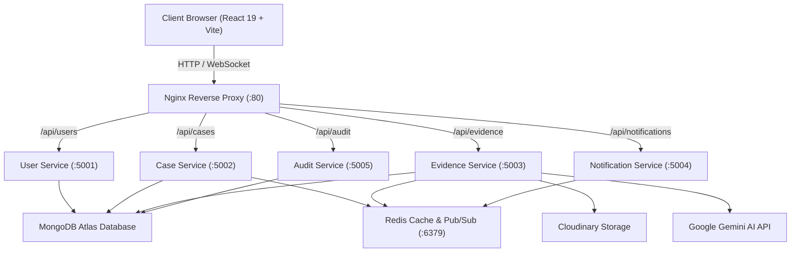

# 🛡️ Secure Digital Evidence Management System (SDEMS)

[](https://github.com/vamshiG24/secure-digital-evidence)
[](https://github.com/vamshiG24/secure-digital-evidence)
[](https://github.com/vamshiG24/secure-digital-evidence)
[](https://github.com/vamshiG24/secure-digital-evidence)

An enterprise-grade, cybersecurity-focused digital evidence management and forensic intelligence platform engineered for law enforcement, digital forensics units (DFIR), and investigative teams.

---

## 🌟 Key Features

### 1. 🔐 Cryptographic Chain of Custody & Security
* **Automated SHA-256 Checksums**: Every uploaded piece of evidence is hashed client/server side on arrival to detect tampering or bit-rot.
* **Tamper-Proof Cloud Storage**: Integrated with Cloudinary raw file pipelines with immutable links and metadata preservation.
* **Two-Factor Authentication (2FA)**: Mandatory email-based OTP verification powered by Nodemailer SMTP before granting privileged session access.
* **Role-Based Access Control (RBAC)**: Strict segregation of duties across **Admin**, **Investigator**, and **Analyst** roles.
* **Immutable Audit Trail**: Every case access, evidence view, hash check, and dossier export is permanently logged with IP address and client User-Agent.

### 2. 🤖 Multimodal AI Forensics & RAG Intelligence
* **Google Gemini Multimodal RAG**: Autonomous agent service indexing and analyzing documents, PDFs, metadata, and case notes.
* **Forensic Inspector**: Deep automated scans identifying entities, suspect timelines, discrepancies, and forensic indicators.
* **One-Click Court Dossier Export**: Formats complete case chronologies, chain of custody logs, and cryptographic signatures ready for legal presentation.
* **AI Evidence Assistant**: Real-time natural language query assistant for searching case details and evidence links.

### 3. ⚡ Scalable Microservices & DevOps Architecture
* **Containerized Deployment**: Preconfigured multi-container stack orchestrated via `docker-compose.yml`.
* **Nginx Reverse Proxy**: Single ingress point routing traffic seamlessly between the frontend and discrete backend microservices.
* **Redis Caching & Pub/Sub**: High-performance caching layer for case metadata and fast event-driven pub/sub messaging.
* **Decoupled Microservices**:
  * `user-service` (Port 5001)
  * `case-service` (Port 5002)
  * `evidence-service` (Port 5003)
  * `notification-service` (Port 5004)
  * `audit-service` (Port 5005)

### 4. 🎨 Modern UI / UX & Command Center
* **Command Palette (`Ctrl + K` / `Cmd + K`)**: Instant keyboard navigation, quick search, and global actions.
* **Adaptive Dark / Light Themes**: Ultra-crisp high-contrast cyber dark mode and modern clean light mode.
* **Micro-Animations & Smooth Routing**: Powered by Framer Motion and modern CSS styling.

---

## 🏗️ Architecture Overview



---

## 🛠️ Tech Stack

* **Frontend**: React 19, Vite, React Router v7, Framer Motion, Lucide React, Axios, React Hot Toast
* **Backend**: Node.js, Express 5, Mongoose 9, Socket.io, Multer, Helmet, Morgan, Redis Client
* **AI & Machine Learning**: Google GenAI SDK (`@google/genai`), PDF Parser (`pdf-parse`)
* **Security & Auth**: JWT, Bcrypt.js, Nodemailer (SMTP 2FA OTP), SHA-256 Hashing
* **DevOps & Infrastructure**: Docker, Docker Compose, Nginx, Redis Alpine

---

## 🚀 Quick Start Guide

### Prerequisites
* [Node.js](https://nodejs.org/) (v18 or higher recommended)
* [Docker](https://www.docker.com/) & Docker Compose (for containerized setup)
* MongoDB connection string (local or [MongoDB Atlas](https://www.mongodb.com/cloud/atlas))

---

### Method 1: Run with Docker Compose (Recommended for Production / DevOps)

1. **Clone the repository**:
   ```bash
   git clone https://github.com/vamshiG24/secure-digital-evidence.git
   cd secure-digital-evidence
   ```

2. **Configure Environment Variables**:
   Copy the template and fill in your credentials:
   ```bash
   cp server/.env.example server/.env
   ```

3. **Launch the stack**:
   ```bash
   docker-compose up --build -d
   ```

4. **Access the application**:
   * **Web App (Nginx Ingress)**: `http://localhost`
   * **Frontend Direct**: `http://localhost:5174`
   * **Redis**: `localhost:6379`

---

### Method 2: Run Locally for Development

#### 1. Backend Setup

```bash
cd server
npm install
```

Configure your `server/.env` file:
```env
PORT=5000
NODE_ENV=development
MONGO_URI=mongodb+srv://<username>:<password>@cluster.mongodb.net/<dbname>
JWT_SECRET=your_super_secret_jwt_key
CLOUDINARY_CLOUD_NAME=your_cloud_name
CLOUDINARY_API_KEY=your_cloudinary_api_key
CLOUDINARY_API_SECRET=your_cloudinary_api_secret
SMTP_HOST=smtp.gmail.com
SMTP_PORT=587
SMTP_USER=your_email@gmail.com
SMTP_PASS=your_gmail_app_password
EMAIL_FROM="Secure Evidence System <your_email@gmail.com>"
GEMINI_API_KEY=your_gemini_api_key
REDIS_URL=redis://localhost:6379
```

Seed initial administrative accounts and demo cases:
```bash
npm run seed
```

Start the monolithic development server:
```bash
npm run dev
```

*(Optional) Start discrete microservices individually:*
```bash
npm run dev-user          # Port 5001
npm run dev-case          # Port 5002
npm run dev-evidence      # Port 5003
npm run dev-notification  # Port 5004
npm run dev-audit         # Port 5005
```

#### 2. Frontend Setup

In a new terminal:
```bash
cd client
npm install
npm run dev
```

The application will be running at `http://localhost:5173`.

---

## 🔑 Default Seed Credentials

After running `npm run seed`:

| Role | Email | Password |
| :--- | :--- | :--- |
| **Administrator** | `admin@secureevidence.com` | `password123` |
| **Investigator** | `investigator@secureevidence.com` | `password123` |

> *Note: If 2FA OTP is enabled, check your configured SMTP inbox or server terminal output for the 6-digit verification code.*

---

## 📂 Repository Structure

```
secure-digital-evidence/
├── client/                     # Frontend Application (React 19 + Vite)
│   ├── src/
│   │   ├── api/                # Axios interceptors & API client
│   │   ├── components/         # Modals, CommandPalette, Assistant, Navbars
│   │   ├── context/            # AuthContext (JWT & 2FA state)
│   │   ├── layouts/            # Responsive AppLayout with Sidebar & Drawer
│   │   ├── pages/              # Dashboard, Cases, Evidence, AI Studio, Audit
│   │   └── index.css           # Design tokens, variables & animations
│   ├── Dockerfile
│   └── vite.config.js
├── server/                     # Backend API & Forensic Services
│   ├── config/                 # Database & Redis configuration
│   ├── controllers/            # Case, Evidence, Audit, User, RAG controllers
│   ├── microservices/          # Independent services (User, Case, Evidence, etc.)
│   ├── middlewares/            # RBAC Auth, Rate Limiter, Audit Logger
│   ├── models/                 # Mongoose schemas (Case, Evidence, User, Audit)
│   ├── routes/                 # Express API routes
│   ├── services/               # Gemini RAG, Forensic Agents, Email (2FA)
│   ├── .env.example            # Environment variables template
│   ├── Dockerfile
│   ├── seeder.js               # Database population script
│   └── server.js               # Core Express gateway
├── docker-compose.yml          # Multi-container orchestration
├── nginx.conf                  # Nginx proxy & routing rules
├── .gitignore                  # Security-hardened git exclusion rules
└── README.md
```

---

## 🛡️ Security & Best Practices

* **Never commit `.env` files**: All secrets and credentials must remain in `.env` (ignored by `.gitignore`).
* **Evidence Immutability**: Evidence records cannot be silently modified without altering their SHA-256 hash, immediately flagging custody tampering in the audit log.
* **API Rate Limiting**: Protection against brute-force authentication and spam requests.
* **Security Headers**: Hardened with Helmet for secure HTTP response headers.

---

## 📄 License

This project is licensed under the [ISC License](LICENSE).
